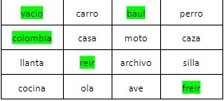

# _Ejercicio 10/2.0_

En este ejercicio se pide hallar las palabras con 
vocales seguidas de una matriz quemada con los metodos recursivos.

## _Problematica_

Dada una matriz de String de 4 x 4 conformada por palabras, hallar las 
palabras que tienen dos vocales seguidas de forma recursiva y agregarlas a un ArrayList. 
Ejemplo de la matriz a probar.




## _Tool_
- Java 17
- Maven
- IDE Intellij

___________

# _Class_

## _MainApp_

```java
public class App10 {

    public static void main(String[] args) {

        System.out.println("");
        System.out.println(" --EJERCICIO 10-- ");

        ArrayList listaPalabras = new ArrayList();

        String[][] m = {

                {"vacio", "carro", "bAul", "perro", "hola"},
                {"colombia", "casa", "moto", "caza", "aereolina"},
                {"llanta", "reir", "archivo", "silla", "abuela"},
                {"cocina", "ola", "aver", "freir","a"}
        };

        System.out.println("");
        recorrerMatriz(m, 0, 0, listaPalabras);
        System.out.println("\n \nARRAYLIST DE PALABRAS CON VOCALES SEGUIDAS: " + listaPalabras);
        System.out.println("""
                              
                              } MATRIZ TRANSPUESTA {                 
                """);
        listaPalabras.clear();
        recorrerMatrizTranspuesta(m,0,0,listaPalabras);
        System.out.println("\n \nARRAYLIST DE PALABRAS CON VOCALES SEGUIDAS TRANSPUESTA: " + listaPalabras);


    }

    public static boolean verificar(int i, String palabra) {

        boolean ver = false;
        if (i == palabra.length() - 1) {
            return ver;
        }
        if (esVocal(palabra.charAt(i))) {
            if (esVocal(palabra.charAt(i + 1))) {
                ver = true;
                return ver;
            } else {
                return verificar(i + 1, palabra);
            }
        }
        return verificar(i + 1, palabra);
    }

    public static boolean esVocal(char palabra) {
        return palabra == 'a' || palabra == 'e' || palabra == 'i' || palabra == 'o' || palabra == 'u'
                || palabra == 'A' || palabra == 'E' || palabra == 'I' || palabra == 'O' || palabra == 'U';
    }


    public static void recorrerMatriz(String[][] m, int i, int j, ArrayList listaPalabras) {

        String palabra = m[i][j];
        System.out.print(m[i][j]);

        if (i != m.length - 1 || j != m[i].length - 1) {

            if (j == m[i].length - 1) {

                if (verificar(0,palabra) == true)
                    listaPalabras.add(palabra);
                i++;
                j = 0;
                System.out.println(" || ");
            } else {

                if (verificar(0,palabra) == true)
                    listaPalabras.add(palabra);
                j++;
                System.out.print(" || ");
            }
            recorrerMatriz(m, i, j,listaPalabras);
        }
    }

    public static void recorrerMatrizTranspuesta(String[][] m, int i, int j, ArrayList listaPalabras) {

        String nombre = m[i][j];
        System.out.print(m[i][j]);

        if (i != m.length - 1 || j != m[i].length - 1) {

            if (i == m.length - 1) {

                if (verificar(0,nombre) == true)
                    listaPalabras.add(nombre);
                System.out.print("\n");
                recorrerMatrizTranspuesta(m, 0, j + 1, listaPalabras);

            } else {
                if (verificar(0,nombre) == true)
                    listaPalabras.add(nombre);
                i++;
                System.out.print(" || ");
                recorrerMatrizTranspuesta(m, i, j,listaPalabras);
            }
        }
    }
}

```